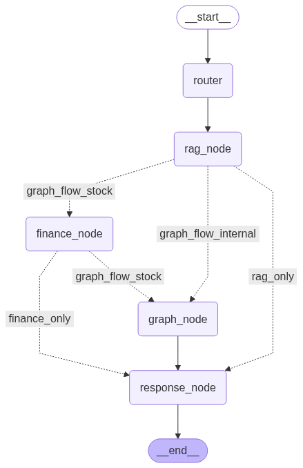

# Renaulution-rag
 Le projet a pour objectif d'implémenter un chatbot sur un pattern multi-agent, capable de répondre aux questions des utilisateurs sur Renault. Le RAG est basé sur un ensemble de docs : pdf, talks youtube, données boursières provenant de l'API yfinace.

### Choix de la solution technique
J'ai fait le choix d'opter pour un RAG agentique implémenté avec le framework langgraph pour répondre au cas d'usage. Le système se décline comme le montre la figure ci-dessous : 
.

Le système est composé de cinq noeuds : 
- Router : le noeud d'entrée qui agit en "plannigicateur". Il détecte l'intention usager et défini la route (enchainement des étapes) à suivre. Les différentes routes possibles sont au nombre de quatre :
    - rag_only : lorsque la doc indexée seule suffit pour répondre à la question
    - finance_only : l'utilisateur veut des données financières/et ou boursières exclusives mais sans graphe
    - graph_flow_stock : l'utilisateur demande des données boursières sous un rendu graphique
    - graph_flow_internal : l'utilisateur demande des données d'exploitation renudes graphiquement

- rag_node : noeud RAG qui permet de récuperer le contexte permettant de répondre à la question
- graph_node : noeud d'affichage. Il construit tout ce qui est graphe, demandé par l'utilisateur
- finance_node : Ce noeud sert à interroger l'API yfinace pour extraire des données boursières.

### Détails sur le RAG
Le noeud RAG est un agent permettant de répondre aux questions des utilisateurs, ou bien de fournir la matière aux autres noeuds du graphe, en se basant sur la documentation interne de **Renault**.

L'architecture adoptée est volontairement simple et efficace. Voici les différentes composantes utilisées :

- Bibliothèque d'implémentation des workflows : `LangChain`
- Modèle d'embedding : [`BAAI/bge-m3`](https://huggingface.co/BAAI/bge-m3), un modèle multilingue open source performant
- Base de données vectorielle : `FAISS vectorstore`
- Stratégie de parsing :
  - **PDF** : extraction avec `Docling` pour une extraction efficace → conversion en markdown → chunking respectant la structure du document
  - **Transcript YouTube** : utilisation du loader `YoutubeLoader` de LangChain → chunking basé sur le nombre de mots
- Stratégie de chunking : chunking par défaut de **150 mots** avec un **overlap de 25 mots**
- Modèle de génération : `gemini-1.5-flash` via Google AI Studio

J'ai aussi implémenté un **retriever hybride** combinant recherche **sémantique** et **lexicale** :
- La partie **lexicale** est gérée avec le modèle **BM25**
- Cela permet de mieux combiner mots-clés exacts et compréhension du sens global

### Composition de projet : 


### Comment exécuter l'app ?
Une interface de chat developpée sous flask permet d'interagir avec le système. L'ensemble de l'app est packagé pour tourner dans un conteneur docker. Il faut donc avoir docker d'installé sur la machine.
Pour lancer l'application  : 
 - modififier le fichier d'environnement(.env) et mettre votre clé `GOOGLE_API_KEY`
 - se placer à la racine du projet (renaulution-rag/) et lancer la commande : 
```bash 
docker-compose up --build
 ```
 L'app fask demarre sur l'url : `http://127.0.0.1:5000`

**NB** : le build de l'image docker et la créatin du conteneur prennent une dizaine de minutes.

### Prochaines étapes : 
Dans cette première version, j'ai fait le choix d'implémentation de l'architechture globale de la solution. Les différents agents ne sont pas pour le moment optimaux, notamment l'agent finance et l'agent plot. Actuellement ce ne sont que des tools (faute de temps). L'idée serait d'avoir des noeuds autonomes, avec des capacités d'analyse et de prise de décision (intégrer des intéractions llm afin de pouvoir analyser les états et prendre des décisions en conséquence).

Parmi les points à couvrir identifiés : 
- Ajouter une gestion de la mémoire de chat
- Optimiser le prompt du RAG
- Mieux structurer la réponse graphique générée
- Ajouter les sources utilisées dans la réponse fournie
- Affiner le retriever et tester un modèle de reranking
- Tester une autre stratégie de chunking
- Tester un autre modèles d'embedding

